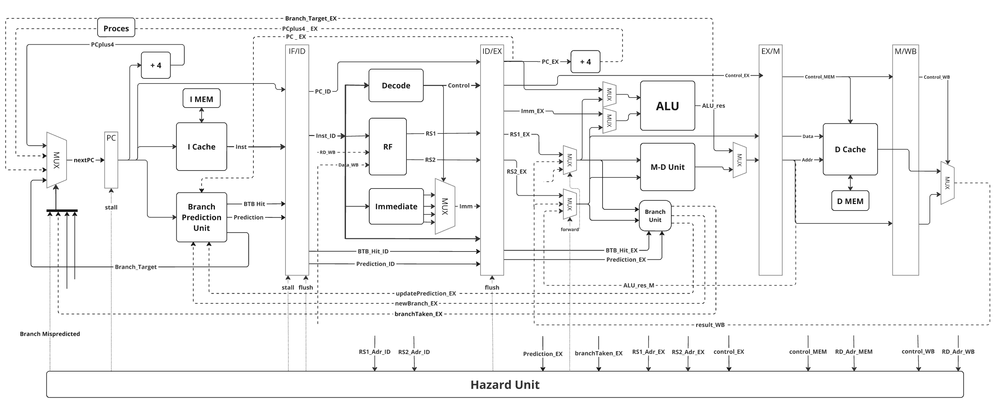

 
<!-- PROJECT LOGO -->

  
  <h3 align="center">
  5-Stage Pipelined RISC-V Core in Chisel
   
  Educational Project
  </h3>
  

    <a href="https://github.com/RPTU-EIS/RISCV-Core/issues">Report Bug</a> 
  

<!-- TABLE OF CONTENTS 

  
Table of Contents

  <ol>
    <li>
      <a href="#about-the-project">About The Project</a>
    </li>
    <li>
      <a href="#getting-started">Getting Started</a>
      <ul>
        <li><a href="#prerequisites">Prerequisites</a></li>
        <li><a href="#installation">Installation</a></li>
      </ul>
    </li>
    <li><a href="#roadmap">Roadmap</a></li>
    <li><a href="#contact">Contact</a></li>
    <li><a href="#acknowledgments">Acknowledgments</a></li>
  </ol>

 -->

## Core Design

## Dependencies

The project requires the following dependencies to be installed:

- Scala 2.12.13
- Chisel 3.5

## Usage

To run the project, simply run the following command in your terminal:

`sbt run`

This will generate Verilog code for the pipelined processor.

To run the testbench, simply run the following command in your terminal:

`sbt test`

This will simulate it using the included testbench.

Note that testHarness variables are only for testing purposes and are not necessary for the project structure.

## Tools

GTKWave or [Surfer](https://app.surfer-project.org/) can be used for debugging or to verify the results.

## Structure

The project is structured as follows:

- `RISCV_TOP.scala`: The main Chisel file containing the pipelined RISC-V processor.
- `RISC_TOP_tb.scala`: A ScalaTest spec that tests the pipelined processor.

## Test Case Generation

The standard RISCV benchmark programs can be found in riscv-tests and compiled with a rv32 compiler.
The linker is configured to let the PC start at 0x00000000 and to put the stack pointer at 0x40000000.

Running `make all` re-generates the .hex files.
The .hex files are in a format that can be read into the memory of the processor.

## Participants and Collaborators

Supervision and Organization: Tobias Jauch, Philipp Schmitz, Alex Wezel

Student Workers: Giorgi Solomnishvili, Zahra Jenab Mahabadi, Tsotne Karchava, Abdullah Shaaban Saad Allam, Kamal Baghirli, Andro Mazmishvili.

[product-screenshot]: images/screenshot.png
